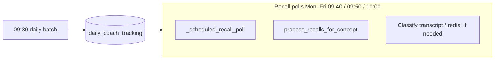

# Morning coaching calls — logic and flow

This document describes how **scheduled** morning coaching outbound calls work: who is dialled, when dials may start and stop, how **recall** retries fit in, and how this differs from **manual / API / CLI** runs.

For general usage (CLI, HTTP routes, tests), see [`USAGE_AND_TESTS.md`](USAGE_AND_TESTS.md). For deployment and scheduler versus AWS/Railway notes, see [`DEPLOYMENT_AND_SEQUENCE_REPORT.md`](DEPLOYMENT_AND_SEQUENCE_REPORT.md).

---

## 1. Goals

- **Reach every mapped advisor** in the morning batch: there is **no** requirement for prior CRM activity (calls/meetings “yesterday”). Anyone who passes Mongo + Supabase phone mapping can receive an outbound coaching dial.
- **Scheduled automation only**: the **first outbound wave** from the **APScheduler daily job** places VAPI calls only when the wall clock in **Europe/London** is between **09:30:00** and **10:00:59** (inclusive).
- **Operators and integrations** using HTTP or CLI are **not** bound to that window unless they choose to run inside it manually.

---

## 2. Two execution paths (scheduled vs manual)

| Path | How it is triggered | Morning 09:30–10:00 London outbound rule |
|------|---------------------|------------------------------------------|
| **Scheduled daily batch** | `ENABLE_SCHEDULER=1`, job id `daily_all_concepts`, cron `DAILY_CRON` (default `30 9 * * *`), timezone `SCHEDULER_TZ` (default `Europe/London`) | **Yes.** `process_concept(..., enforce_scheduled_morning_window=True)` |
| **HTTP** `POST /run-all`, `/run/{concept}`, `/run/{concept}/advisors` | Manual or external caller | **No** enforcement flag |
| **CLI** `python -m advisor_daily_workflow` | Operator | **No** enforcement flag |

Implementation detail: only `_scheduled_daily()` in `main.py` passes `enforce_scheduled_morning_window=True` into `process_concept()`.

---

## 3. Clock rules for the scheduled morning batch

Function: `_scheduled_morning_outbound_dial_allowed()` in `workflow_engine.py`.

- **Timezone:** `Europe/London` (local time, including BST/GMT as applicable).
- **Allowed outbound dial window:** from **09:30:00** through **10:00:59** on the London clock.
- **Weekends:** there is **no** Saturday/Sunday filter on this window for the **initial outbound** batch (if your `DAILY_CRON` runs on a weekend, the same time band applies).

### 3.1 When the batch starts outside the window

If the daily job fires **before** 09:30 or **after** 10:00:59 (misfire, clock skew, delay), `ConceptWorkflow.run()` **aborts that concept’s run** immediately: no advisor processing for that concept in that invocation.

### 3.2 When the batch starts inside the window but runs past 10:00

Processing is **concurrent** (thread pool, size from `VAPI_MAX_CONCURRENT_PER_CONCEPT`). For **each** advisor:

1. After basic eligibility (Mongo user id present), the workflow checks the window again; if time has closed, the outcome is **`skipped_morning_window`** (no Hubstaff/NAC/VAPI work for that advisor).
2. After building `daily_payload`, **immediately before** `call_vapi_advisor`, the window is checked again so a slow preparation step cannot place a dial after **10:00:59**.

**Implication:** with a large advisor list or low concurrency, **not everyone may receive a dial** before the window closes. Remaining advisors are counted under **`skipped_morning_window`**. To reduce this, increase concurrency (carefully) or split cohorts / run additional off-peak batches via API (which ignores the window).

---

## 4. Recall (follow-up dials after the first wave)

Recall is separate from the initial batch: it processes rows in Supabase **`daily_coach_tracking`** where `final_status` still indicates a recall path, classifies the last VAPI outcome (OpenAI), and may place another dial.

### 4.1 Scheduler triggers (default)

With `RECALL_USE_MORNING_SLOT_CRON=1` (default) and **without** `RECALL_POLL_INTERVAL_SECONDS`, APScheduler registers **three** recall polls on **Monday–Friday** only (London):

- **09:40**
- **09:50**
- **10:00**

So retries align with a **10-minute ladder** after the **09:30** initial wave.

### 4.2 Recall time gate

With `RECALL_MORNING_WINDOW_ONLY=1` (default), `process_recalls_for_today()` only runs recall logic when London time is **weekday** and between **09:30:00** and **10:00:59** (`_is_morning_coaching_recall_window()`). Outside that band, the poll returns early (no redials).

**Tests / staging:** `RECALL_POLL_IGNORE_LONDON_HOURS=1` bypasses both the weekday and morning recall gate (see live scheduler tests).

### 4.3 Attempt cap

`RECALL_MAX_CALL_ATTEMPTS` (example: **4** in `.env.example`) limits how many dial attempts count toward recall stops. **`0`** means unlimited in code—set explicitly in production if you want a hard cap (e.g. initial + three retries).

---

## 5. End-to-end flow (scheduled morning)

```mermaid
sequenceDiagram
    autonumber
    participant Cron as APScheduler (DAILY_CRON)
    participant Main as main._scheduled_daily
    participant PC as process_concept (enforce window)
    participant WF as ConceptWorkflow.run
    participant PA as process_single_advisor
    participant VAPI as VAPI outbound

    Cron->>Main: 09:30 London (default)
    loop Each concept
        Main->>PC: enforce_scheduled_morning_window=True
        PC->>WF: run(...)
        alt Outside 09:30–10:00:59 London at start
            WF-->>Main: abort concept (no dials)
        else Inside window
            WF->>WF: load advisors, map Supabase phones
            loop Each advisor (pool)
                WF->>PA: process_single_advisor
                alt Outside window before prep
                    PA-->>WF: skipped_morning_window
                else Payload built; still inside window
                    PA->>VAPI: POST /call
                else Outside window before dial
                    PA-->>WF: skipped_morning_window
                end
            end
        end
    end
```



---

## 6. Coaching context on the call (brief)

The VAPI dial sends `assistantOverrides.variableValues` including **`daily_payload`**. That payload includes CRM counts, optional Hubstaff block, trainings, NAC/coaching slices, and **`Objective of the day`** derived from Hubstaff + tier (see `hubstaff.build_objective_of_the_day` and `workflow_engine.build_daily_payload`). Assistant **prompts** live in VAPI; this service supplies **data** only.

---

## 7. Metrics keys (scheduled run)

Typical keys returned from `process_concept` / `ConceptWorkflow.run`:

- `processed`, `success`, `skipped`, `failed`
- **`skipped_morning_window`** — advisor skipped because the London outbound window had closed (or batch started outside the window for per-advisor checks)

---

## 8. Related environment variables

| Variable | Role |
|----------|------|
| `ENABLE_SCHEDULER` | Turn on APScheduler in `main.py` |
| `SCHEDULER_TZ` | Default `Europe/London` |
| `DAILY_CRON` | Default `30 9 * * *` (09:30) |
| `RECALL_USE_MORNING_SLOT_CRON` | Default on: 09:40, 09:50, 10:00 Mon–Fri recall triggers |
| `RECALL_POLL_INTERVAL_SECONDS` | If set, overrides morning slot cron (interval recall) |
| `RECALL_POLL_CRON` | Fallback cron when interval unset and morning slots off |
| `RECALL_MORNING_WINDOW_ONLY` | Recall gate limited to morning band on weekdays (default on) |
| `RECALL_MAX_CALL_ATTEMPTS` | Cap dial attempts (0 = unlimited in code) |
| `RECALL_POLL_IGNORE_LONDON_HOURS` | Bypass recall time gates (tests/staging) |
| `VAPI_MAX_CONCURRENT_PER_CONCEPT` | Parallel advisor workers |

See `.env.example` for full templates.

---

## 9. Code map

| Area | Location |
|------|----------|
| Scheduled daily + recall job registration | `main.py` (`lifespan`, `_scheduled_daily`, `_scheduled_recall_poll`) |
| Morning outbound window (scheduled only) | `workflow_engine.py` — `_scheduled_morning_outbound_dial_allowed`, `run()`, `process_single_advisor()`, `process_concept(..., enforce_scheduled_morning_window=...)` |
| Recall morning gate (weekday + time) | `workflow_engine.py` — `_is_morning_coaching_recall_window`, `process_recalls_for_today` |
| Objective of the day | `hubstaff.build_objective_of_the_day`, merged in `build_daily_payload` |

---

## 10. Document maintenance

When changing cron defaults, recall gates, or `enforce_scheduled_morning_window` wiring, update this file and the module docstring at the top of `main.py` so operators stay aligned with behaviour.
